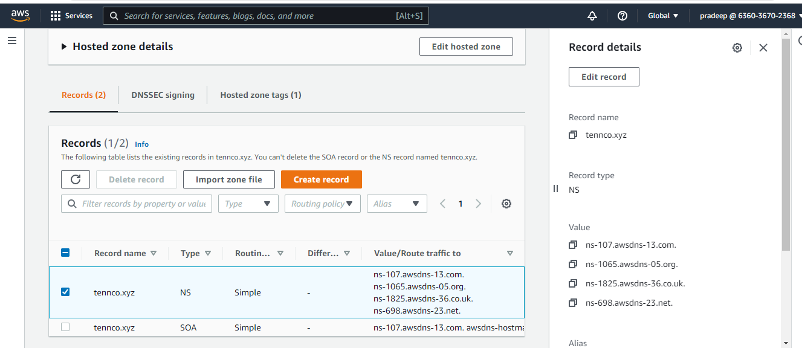
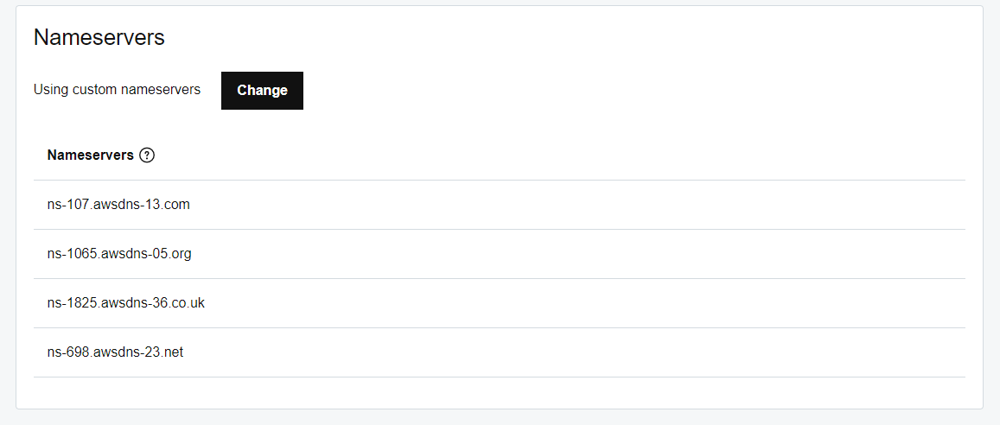
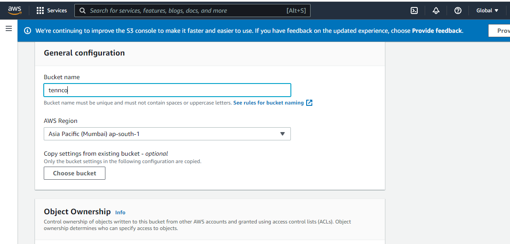
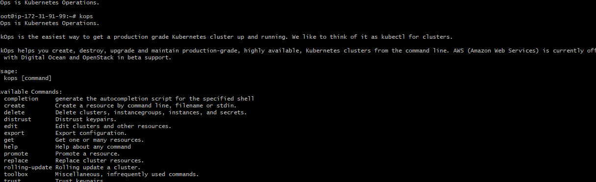

# Installing kubernetes cluster 
## using kops tool
it is an automation provisioning tool
### Prereqisetes:
1. DOMAIN NAME
2. Route 53 Domain integration
3. AWS account & AWS cli install and Configure accesskey/secretkey
4. S3 BUCKET
5. KOPS Binary
6. SSH Public & Pivate keys
7. Management Server - t2.micro machine
---
we are creating the cluster environment as
* one Master
* two worker Nodes
---
# set up the DNS Service
configure the route 53 in aws
create a hosted zone in aws 
we get ns and soa record
these ns records are integrated to your domain name on godaddy

Then login to godady
click managedns on your domain name
chenge the name servers on goddady replaced with aws ns names

ns names integrated on godaddy

---
# know creating s3 bucket 
we have to create s3 bucket in aws

# Create management or gem server for KOPS
here management server is created on aws
speifications
t2microns 
## to get the kops binary
it is for creating cluster
now downlode the kops 
get the link from githup
[githup link for kops release](https://github.com/kubernetes/kops/releases)

[Downlode binary link for linux](https://github.com/kubernetes/kops/releases/download/v1.22.2/kops-linux-amd64)

```
wget https://github.com/kubernetes/kops/releases/download/v1.22.2/kops-linux-amd64
```
change the file mode to executable
* chmod 700 \<filename>
```
chmod 700 kops-linux-arm64
```
move the file to /usr/local/bin
* mv \<filename> \<destination path>
```
mv kops-linux-arm64 /usr/local/bin
```
rename the file 
* mv \<filename> \<new file name>
```
mv kops-linux-arm64 kops
```
check the installation 

```
kops version
```
## Then install kubectl 
The reference link is [kubectl official](https://kubernetes.io/docs/tasks/tools/install-kubectl-linux/)

Downlode the binary file
```
curl -LO "https://dl.k8s.io/release/$(curl -L -s https://dl.k8s.io/release/stable.txt)/bin/linux/amd64/kubectl"

```
then move the file to /usr/local/bin
```
mv kubectl /usr/local/bin
```
change the file permissions to exdecutsble
```
chmod 700 kubectl
```
know test the kubectl
```
kubectl version --client
```
or
```
kubectl version
```
---
## generate Publiic and Private keys for user
```
ssh-keygen
```
it generates public and private keys on ~/.ssh/id_rsa and ~/.ssh/id_rsa.pub

---
## install aws cli 
configure access key and secret keys 

update and install unzip package
```
apt-get update && apt-get install unzip -y
```
cli [offical docs](https://docs.aws.amazon.com/cli/latest/userguide/getting-started-install.html)

Download cli
```
curl "https://awscli.amazonaws.com/awscli-exe-linux-x86_64.zip" -o "awscliv2.zip"
unzip awscliv2.zip
sudo ./aws/install
```
configure the aws cli user athentication
```
aws configure
```
provide the details about access key and secret key details and also region

know check the connection
```
aws s3 ls
```
---
## Cluster deployment
initate cluster
* kops create cluster --name=\<cluster name> --state=s3://\<name of s3> --zones=us-east-1c --node-count=\<no of nodes> --node-size=\<type of node> --master-size=\<type ofinstance> --node-volume-size \<size of node>
--master-volume-size \<size of master> --dns-zone=\<dns name>
```
kops create cluster --name=tennco.xyz --state=s3://tennco --zones=us-east-1c --node-count=2 --node-size=t2.micro --master-size=t2.small --node-volume-size 10 --master-volume-size 20 --dns-zone=tennco.xyz
```
to get the cluster details
```
kops get cluster --state s3://tennco
```
To get the instance group details
```
kops get ig --name tennco.xyz --state s3://tennco  
```
For edit the instance groups
in master
* kops edit ig --name \<cluster name> \<master name> --state=s3://\<s3 name>
```
kops edit ig --name tennco.xyz master-us-east-1c --state=s3://tennco
```
similary for node
* kops edit ig --name \<cluster name> \<node name> --state=s3://\<s3 name>
```
kops edit ig --name tennco.xyz node-us-east-1c --state=s3://tennco
```
## deleting the cluster
```
kops delete cluster --name=tennco.xyz --state=s3://tennco --yes
```

